# 排序与聚合
* 查询计划
    * sql会被解析为语法树，数据从叶子节点流动到根节点，数据之间的通过各种操作的节点后转换成某一结构向上流动。
    * 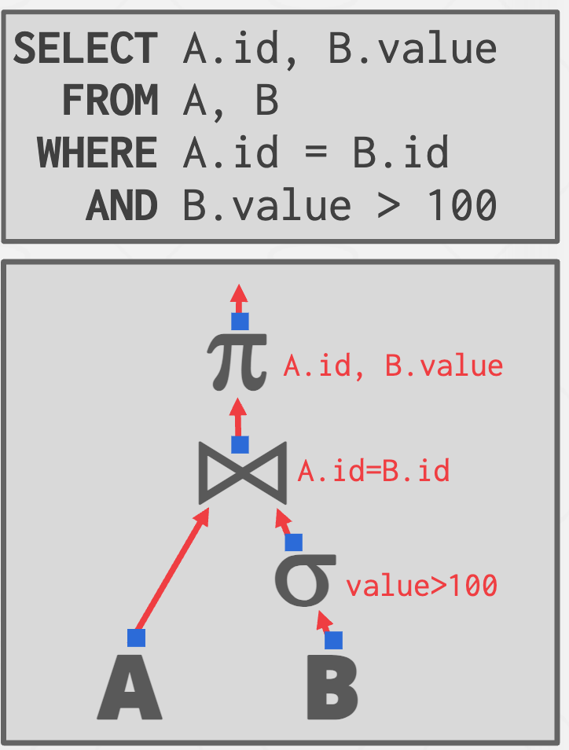

* 面向磁盘的DBMS
    * 不能假设表的数据能够全部装入内存中。
    * 使用缓存池实现需要溢出到磁盘的算法
    * 更愿意算法能最大化顺序的I/O

* 在内存中的排序
    * 如果数据能够装载进内存，则可以使用标准排序算法
    * 如果无法装进内存，则需要外部归并等算法
    
* Top N 堆排序
    * 如果查询中有order by和limit条件，则只需扫描数据，并取出top-N的元素
    * 堆排序能够满足上述要求

* 外部归并排序
    * 分治算法，分割数据到单独的runs中，并对其进行独立的排序，然后将runs们合并为更长的排序的runs
    * 阶段1 排序
        * 排序能够装载进内存的数据块，并将他们写回到磁盘中（不同的磁盘位置）

    * 阶段2 归并
        * 结合排序的runs到更大的块中

* 排序的run
    * run是一个键值对的集合
        * 键是排序属性
        * 值是可以是元祖，也可以是记录ID

* 2路外部归并排序
    *   
    *   
    * 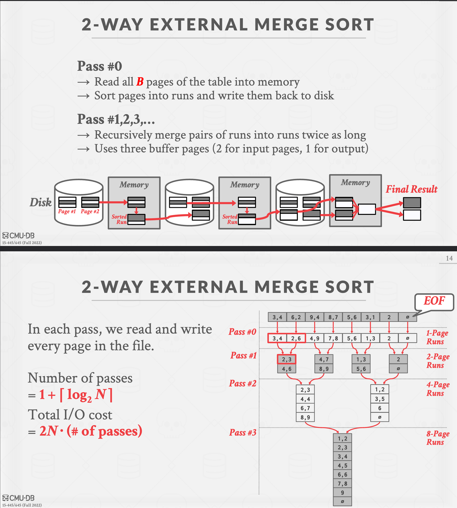

    * 通用外部归并排序
        * pass#0 
            * 使用B缓冲页
            * 生成【N/B】个排序的大小为B的runs
        * pass#1 2 3
            * 归并B-1runs

        * 成本分析
            * 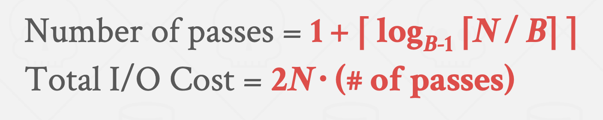

    * 比较的优化
        * 使用硬编码的方式，使用比较函数，而不是传递比较函数的指针

        * 后缀剪辑
            * 比较varchar等可变的类型是，将后缀剪辑后进行比较

* 使用B+树进行排序
    * 聚簇索引（主键作为排序的属性）
        * 此时元组与索引的顺序相同，且已经是排序了的状态，因此只需遍历叶子节点就能得到排好序的结果

    * 非聚簇索引（非主键作为排序的属性）
        * 此时索引的排序顺序与，元组的页的顺序是乱的，因此此时对飞聚簇索引排序的成本非常高

* 聚合
    * 根据一个属性将多个值从多个元组中获取后，将其转换为一个标量
    * 两种实现方法
        * 排序
        * 散列

    * 聚合的示例
        * 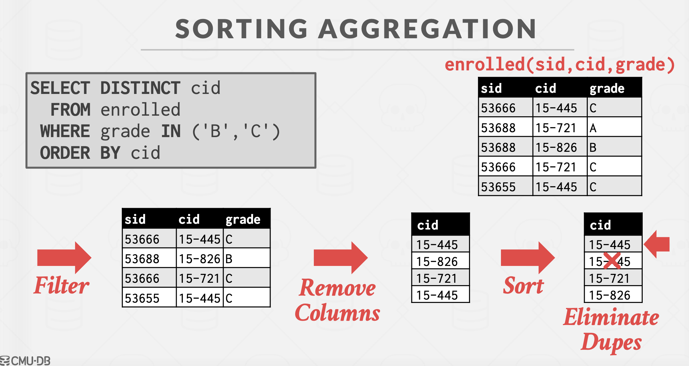

    * 在不需要排序的场景中，如去重与group by等情况下，使用散列的方法效果更好

    * 散列聚合
        * 扫描表中的每个项目，检查在散列表中是否已经存在

        * 如果散列无法全部加载到内存中，则需要使用外部散列聚合的方法

            * 分区
                * 根据散列函数1与需要聚合的属性，将元组散列到各个分区中。
                * 分区完成后，每一个分区内的元组都是需要聚合的属性相同的元组
                * 示例
                    * 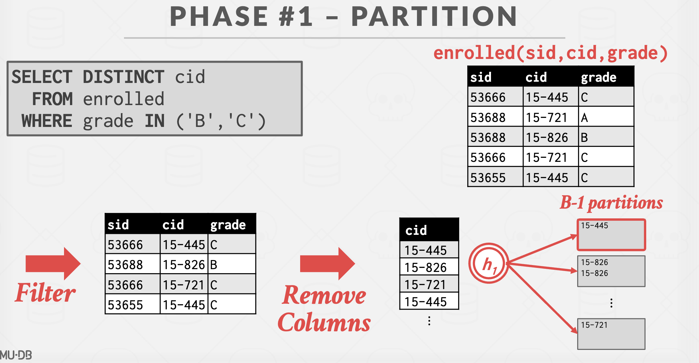
            * 重新散列
                * 对于每一个在磁盘上的分区
                    * 将分区读到内存并根据散列函数2构建在内存中的散列表
                    * 之后遍历每一个散列表的每一个桶，聚合匹配的元组

                * 这一步的假设是每一个分区能够加载到内存中
                * 示例
                    * 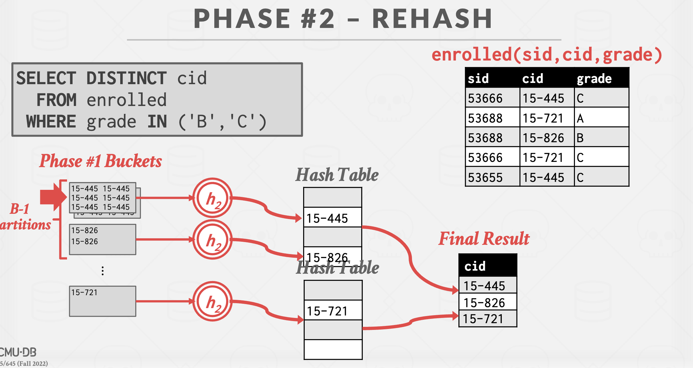

# 11 join 
* 链接算法
    * 二元链接 即左侧和右侧标的结构
    * 通常，较小的表在左侧（外表，即循环的外侧）能够使链接算法更高效
        * 通常优化器尝试识别那个较小的表，当生成了查询计划时

    * 链接算法的选择决定因素
        * 因素1：输出
            * 在查询计划中，什么样的数据使用链接算法输出到父级操作符中？

            * 输出的数据
                * 早期实现化
                    * 将外部元组和内部元组中的属性值复制到一个新的输出元组中
                    * 即为将链接后的全部数据复制一份给下一个操作

                * 晚期实例化
                    * 仅复制两个中的链接键与链接元组的记录ID
                    * 非常适合列存储，因为DBMS不会复制查询不需要的数据

        * 因素2：成本分析
            * 如何决定一个算法比另一个算法好

            * 假设
                * M页在表R中，m个记录在表R中
                * N页在表S中，n个记录在表S中    

            * 链接算法
                * 嵌套循环算法
                    * 简单 ， 效率低
                    * 外层循环遍历表M的记录，内层循环对于每一个外层记录，都遍历一遍内层表S
                    * 成本为M+ (m * N) 
                        * 需要读取M次页和m条记录乘以N个页的读取的处理时间

                * 块嵌套循环算法
                    * 算法描述即为：外循环遍历每一个外层块，对于每一个外层块，在内层循环中遍历每一个内层块，对于每一个内层块，在内内层中遍历每一个外层块中的记录，对于每一个外层块记录，在内内内层中遍历每一个内层块的记录。
                    * 成本为 M+（M*N)
                        * 需要读取M次页和M个外层页乘以N个页的读取的处理时间

                    * 上述块嵌套循环中假设缓冲区一次只能读取3个块（外层块，内层块，输出快）
                    * 如果一个能读取B个块成本将会是什么样
                        * 外层块一次能够被读取B-2个块。
                        * 一个快用于内层，另一个块用于输出

                        * 成为为 M+（（M/B-2 ) *N )
                            * 需要读取M次页和(M/B-2)次内层块的读取

                * 索引嵌套循环
                    * 如果某一个属性在表中已被索引，则可将该表作为内循环，在外循环中遍历所有记录时通过索引查找内循环表中匹配的记录。
                    
                    * 成本为 M+（m*c)
                        * 需要读取M次页和所有m条记录在索引查找时的固定量的总和
                * 归并排序算法
                    * 阶段1 ： 排序
                        * 根据链接属性对两张表进行排序
                        * 可以使用外部归并排序
                    * 阶段2： 归并
                        * 用游标遍历两个排序表，并发出匹配的元组
                        * 可能需要根据连接类型进行回溯

                    * 伪代码示例
                        * 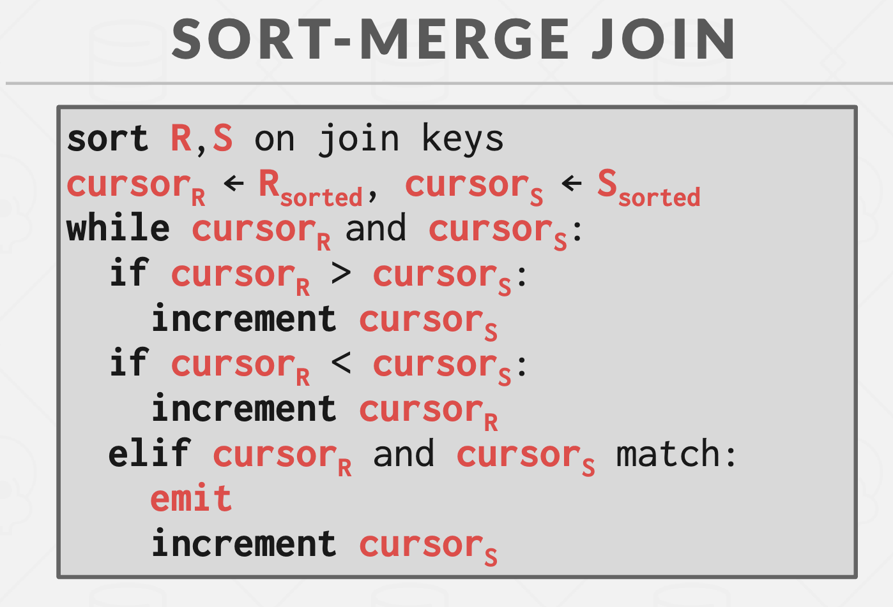

                    * 成本为以下的总和
                        * 2M*（1+(log B-1 (M/B)) :对于外层表的排序成本
                        * 2N*（1+(log B-1 (N/B)) :对于内层表的排序成本
                        * M+N : 只需个遍历一次两个表

                    * 何时适合使用归并排序链接
                        * 一个或两个表已经按连接键排序。
                        * 输出必须按连接键排序。

                * 散列算法

                    * 阶段1：构建
                        * 扫描外部关系，且在链接属性上利用散列函数h1生成散列表
                        * 可以使用任何散列表，但是实践上使用线性探测，因为效果最好

                    * 阶段2：探测
                        * 扫描内部关系，并在每个元组上适应h1散列函数去查找元素是否匹配
                    
                    * 散列表的内容
                        * 键： 在表中链接的属性
                        * 值： 每个实现都不同
                            * 取决于查询计划中连接上方的操作符期望作为其输入的内容
                            * 早期Vs晚期实例化

                    * 成本分析
                        * 使用这种方法可以散列多大的表？    
                            * B-1 在阶段1的泄露分区大小
                            * 每一个都不应该大于B个块大小
                        * 答案：B * （B-1)

                    
                    * 优化： 探测过滤
                        * 当键可能不存在于散列表时，在构建阶段创建Bloom过滤器
                            * 在探测散列表之前，线程检查过滤器
                            * 这将更快，因为过滤器将适合CPU缓存
                            * 有时被称为横向信息传递
                        

                        * Bloom过滤器
                            * 回答集合成员查询的概率数据结构(位图)。
                                * 假的阴性永远不会发生
                                * 假的阳性可能时有发生 **亦即即使在散列表中没有某个值，但是有可能返回该值存在**
                                * [Bloom过滤器计算](https://hur.st/bloomfilter/)

                            * 插入
                            * 查询

                    * 如果没有足够的内存空间存储整个散列表？
                        * 分区散列链接
                            * 构建阶段：将两个表根据连接属性进行哈希分区
                            * 探测阶段：比较每个表中对应分区的元组

                        * 在R和S之间的每对匹配桶中，执行常规哈希连接。
                            * [散列分区](img/散列分区.png)

                        * 如果桶无法加载到内存，则使用递归分区，将表分成合适的块
                            * 使用其他散列函数h2，对桶-r-i构建散列分区
                            * 然后探测该级别上其他表桶的每个元组

                        * 散列链接成本
                            * 3 （M+N ）  M个块个数，N个块个数
                * 链接算法总结
                    * 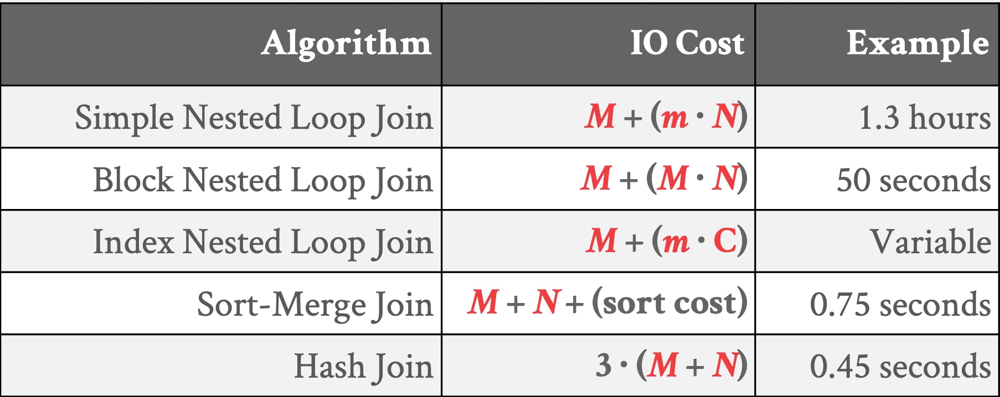

# 12 Query Exequtiob part1
* 
* 处理模型
    * 数据库的处理模型定义系统如何执行查询计划
        * 不同的拖鞋对不同的工作负载
    
    * 方法1：遍历模型
        * 每一个查询计划操作符实现Next()函数
            * 在每一次访问中，操作符返回一个元组或，当没有更多元组时返回null标记
            * 操作符实现调用它的子的Next（）循环，去获得它们的元组然后处理它们
            * 也被称作Volcalno, Pipeline 模型

        * 模型示例
            * 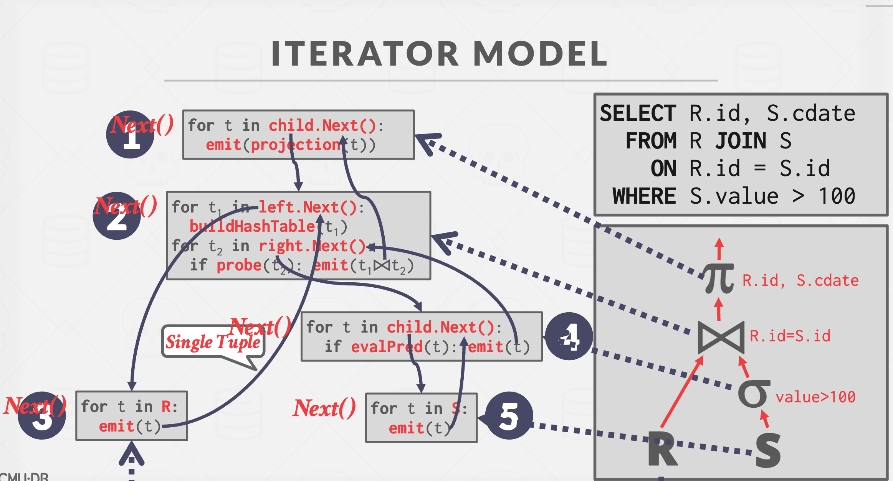

        * 某些操作符必须是阻塞的，直到他们的子发送所有他们的元组
            * JOIN Subqueries， Order By
    
    * 方法2：实体化模型
        * 每一个操作符处理其输入时一次性全部读入，输出时一次性全部输出
            * 运算符将其输出“实现”为单个结果。
            *  数据库管理系统可以下推提示（例如，LIMIT）以避免扫描过多的元组。
            * 可以发送一个已实现的行或单个列。
        * 输出可以是整个元组或列的子集
        * 模型示例
            * 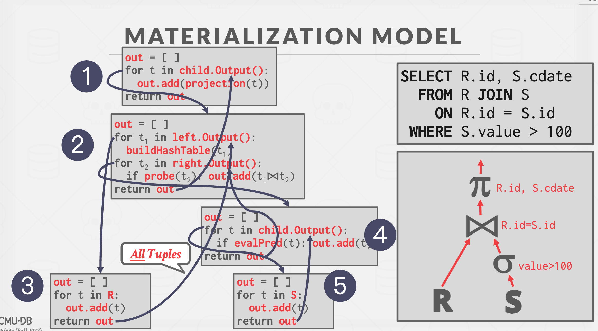

        * 在OLTP的工作负载中表现更好，因为查询只访问少量元组
    * 方法3：向量、批处理模型
        * 类似于遍历模型每个操作符实现一个Next()函数，单数每个操作符一次发送一批元组。
            * 内部操作符循环一次处理多个元组
            * 批的大小可能有变化，大小是基于硬件或查询的属性
            
        * 向量化模型
            * 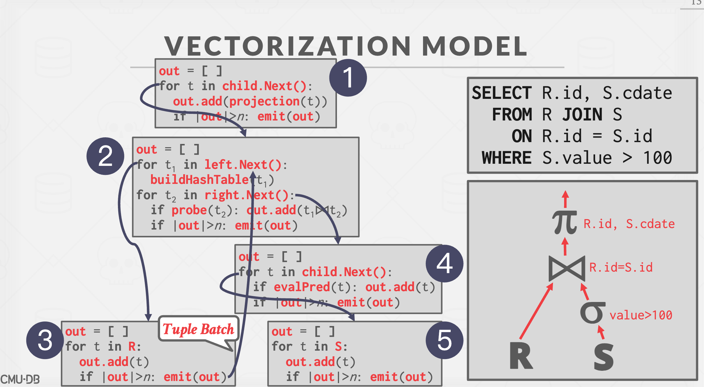

        * 对于OLAP查询非常理想，因为极大地减少了每个操作符的调用次数

    * 访问方法
        * 访问方法是数据库系统访问存于表中数据的方法
            * 
        * 三种基本方法
            * 序列化扫描
                * 对于表中的每个页
                    * 从缓冲区中取得元组
                    * 遍历每一个元组并检查是否包含它
                * 序列化扫描的优化
                    * 序列化扫描是数据库执行查询时几乎是最差的，但是可能是唯一的选项
                    * 优化方法
                        * Prefetching 预取
                        * Buffer pool bypass 缓冲区旁路
                        * Parallelization 并行化
                        * Heap Clustering 堆簇 
                        * Late Materialization 晚实例化
                        * Data Skipping 数据跳过
                            * 方法1： 近似查询 （有损）
                                * 在整个表的抽样子集上执行查询，以产生近似结果。
                            * 方法2：区域地图（无损）
                                * 预先计算每个页面的列聚合，以便数据库管理系统可以检查查询是否需要访问它。
                                * 页面大小与过滤效果之间的权衡。
            
            * 索引扫描
                * DBMS选择一个索引来查找查询所需的元组。
                * 使用哪一个索引依赖于
                    * 索引包含的属性
                    * 查询引用的属性
                    * 属性值域
                    * 谓词组合
                    * 索引是否具有唯一或非唯一键
            * 多序列扫描
                * 如果DBMS可以使用多个索引来查询
                    * 使用每个匹配的索引计算记录ID集合。
                    * 根据查询的谓词（并集 vs 交集）组合这些集合。
                    * 检索记录并应用任何剩余的谓词

    * 修改查询
        * INSERT UPDATE DELETE
        * 万圣节问题
            * 更新操作改变元组的物理位置，导致扫描运算符多次访问该元组的异常。 
                * 可在集群表或索引扫描中发生。
            * 解决方案：跟踪每个查询的修改记录ID。

    * 表达式评估
        * 数据库将where簇表示为表达式树
            * 树中的节点表示不同的表达式类型
                * 比较
                * 且 或
                * 运算操作符
                * 常量
                * 元组属性引用

# Query Execution 2 
* 为什么需要关心并发执行
    * 在相同的硬件资源下提升性能
        * 更高的吞吐量
        * 低延迟

    * 提高了系统的响应性

* 并发与分布式
    * 数据库分布在多个资源上，以改进DBMS的不同方面
    * 对应用程序显示为单个逻辑数据库实例，而不管物理组织如何
        * 在并发或者分布式数据库下，SQL查询对于单一资源数据库应该生成相同的结果

    * 并发
        * 资源在物理上彼此靠近
        * 资源通过高速互连进行通信
        * 交流被假设为便宜且可靠
    
    * 分布式
        * 资源可能相距很远
        * 资源使用慢速互连进行通信
        * 资源成本和问题无法被忽视

* 处理模型
    * 数据库的处理模型定义如何构建为支持来自多用户应用程序的并发请求的系统
    * worker是负责代表客户机执行任务并返回结果的DBMS组件

    * 每worker一个进程
        * 每一个worker是一个OS的独立今晨
            * 依赖于OS的调度者
            * 对全局数据结构使用共享内存
            * 一个进程的崩溃不会影响整个系统
    
    * 每worker一个线程
        * 一个进程与多个工作线程
            * 数据库管理自己的调度
            * 调度线程有可能被使用
            * 线程的崩溃有可能杀掉整个系统
            * 

    * 调度
        * 对于每一个查询计划，数据库决定何时，何地，如何执行
            * 多少个任务需要被使用
            * 多少个CPU核需要被使用
            * 任务应该在哪个CPU核心上执行
            * 任务应该在哪里存储其输出

    * SQL Server -SQLOS
        * SQLOS是用户级别的运行在数据库内部且管理硬件资源的OS层
        * 通过仪表化DBMS代码的非抢占式线程调度
            * [SQLServer on linux](https://techcrunch.com/2017/07/17/how-microsoft-brought-sql-server-to-linux/)
        * SQLOS定量执行4毫秒，但是调度者无法强制执行
            * 数据库开发者，必须在代码的很多地方显式的调用yield

    * 嵌入式数据库
        * 嵌入式数据库执行在应用程序相同的地址空间内。应用程序负责线程与调度
            * 应用程序或许支持外部连接
                * SQLite，rocksDB LevelDB，BerkelyDB

    * 多线程架构的有点
        * 更少的上下文切换开销
        * 不需要管理共享内存
    * 每worker多线程并不意味着数据库支持intra-query（操作内查询）并发

    * INTER-VS INTRA查询并发
        * Inter-Query（操作间查询）：同时执行多个分离的查询
            * 

        * Intra-Query（操作内查询）：并行的执行单一查询操作
            * 方法1：水平操作
                * 将操作符分解为对不同数据子集执行相同功能的独立片段
                * 数据库插入一个exchange操作符到查询计划中，用于合并或分割来自多个子或父操作的结果
                    * 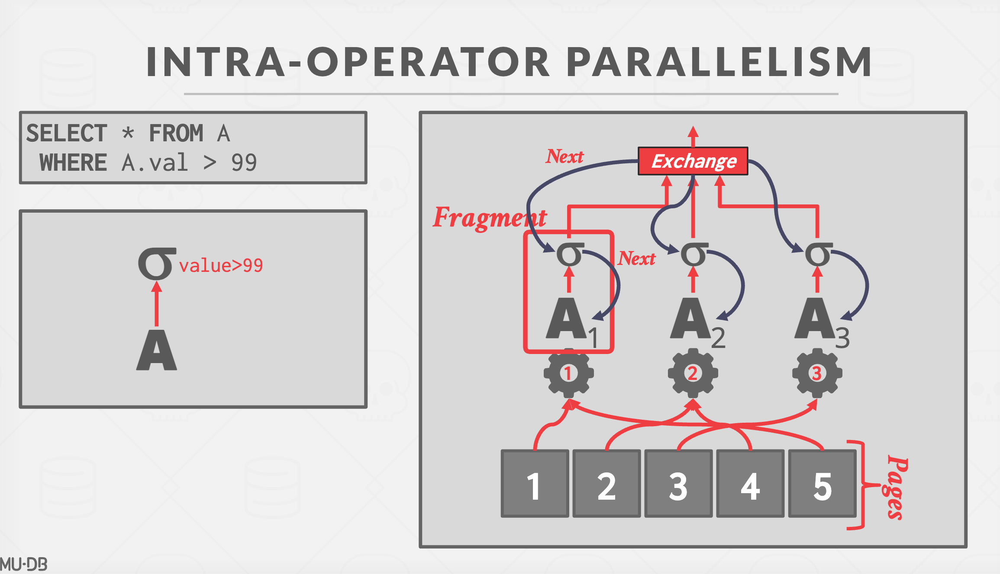
                * Exchange操作符
                    * 类型1：搜集
                        * 结合多个worker的结果输出到一个输出流中
                    * 类型2： 分配
                        * 分割一个结果到过个输出流
                    * 类型3： 再区分
                        * 将多个输入流分配到多个输出流中

            * 方法2：操作间垂直操作 
                * 操作是重叠的，以便将数据从一个阶段输送到下一个阶段，而不会具体化
                * worker同时执行来自查询计划的不同段的操作符。
                * 在流系统中更常见(连续查询)
            * 方法3：Bushy
                * 混合操作符内部和操作符之间的并行性，工作人员同时执行来自查询计划的不同部分的多个操作符
                * 仍然需要交换操作符来合并来自分段的中间结果。

    * 并发散列链接
        * 在分区之后，使用一个分割的worker在每一级的R和S的桶中执行匹配操作

    * I/O 并发
        * 跨多个存储设备拆分DBMS以改善磁盘带宽延迟。
        * 许多不同的选择都有权衡
            * 每个数据库多个磁盘
            * 每个磁盘一个数据库
            * 每个磁盘一个关系
            * 分割关系到多个磁盘

        * 一些数据库管理系统允许您指定每个单独数据库的磁盘位置。→ 缓冲池管理器将页面映射到磁盘位置。

        * 如果DBMS将每个数据库存储在单独的目录中，这也很容易在文件系统级别完成。→ 如果事务可以更新多个数据库，则DBMS恢复日志文件可能仍然是共享的。

        * 分区
            * 将单个逻辑表分为分开存储/管理的不相交物理段
            * 分区(理想情况下)对应用程序应该是透明的。应用程序应该只访问逻辑表，而不必担心数据的物理存储方式

