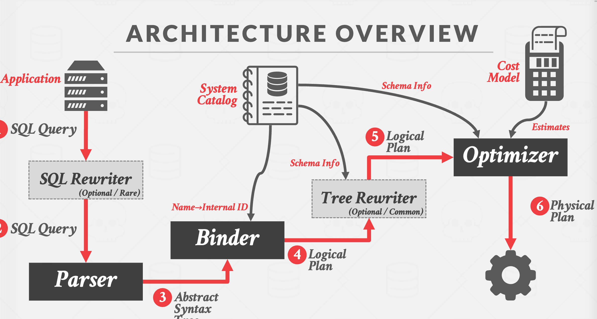

# 14 查询优化
* 对于给定的查询，查找具有最低“成本”的正确的执行计划
* 逻辑 VS 物理计划
    * 优化器生成逻辑代数表达的映射用于优化物理代数表达的等式

    * 物理操作符定义一个明确的执行策略用于访问路径
        * 它们依赖于他们正在处理的物理格式（即 排序，压缩）
        * 并不总是1:1的映射，自物理到逻辑

* 执行过程架构示意图
    * 

* 查询优化
    * 启示法/规则
        * 重写查询，删除愚蠢的无效的内容
        * 这些技术可能需要参考目录册，但是他们不需要参考数据

        * 逻辑查询优化
            * 使用模式匹配规则，转换逻辑计划至等效的逻辑计划
            * 目标是增加在搜索中枚举最优计划的可能性。
            * 不能比较计划，因为没有成本模型，但可以“引导”转换到首选的一方

            * 方法
                * 分割连接谓词
                    * 将谓词分解为最简单的形式，使优化器更容易移动它们
                * 谓词下移
                    * 将谓词移动到计划中的最低适用点
                * 替换笛卡尔乘积
                    * 使用连接谓词将所有笛卡尔积替换为内连接
                * 投影下移
                    * 在管道中断之前消除冗余属性，以降低物化成本。

            * 嵌套子查询
                * DBMS将where子句中的嵌套子查询视为接受参数并返回单个值或一组值的函数。
                + 方法
                    * 将其重写以解除相关性和/或扁平化
                    * 将嵌套查询分解并将结果存储到临时表中

            * 分解查询
                * 对于更复杂的查询，优化器会将查询分解成多个块，并逐个块进行处理。
                * 子查询是写入一个临时表中的，该表在查询完成后被丢弃。
            
            * 表达式重写
                * 优化器将查询的表达式（例如，WHERE/ON子句谓词）转换为最小集合的表达式。

                * 使用if/then/else子句或模式匹配规则引擎实现。→ 搜索与模式匹配的表达式。
                    * 当找到匹配时，重写该表达式。
                    * 如果没有更多符合条件的规则，则停止执行。

    * 基于成本的搜索
        * 使用模型估计计划的执行成本
        * 枚举一个查询的相等的计划，并提取最低成本

        * 成本估计
            * DBMS使用成本模型来预测在给定数据库状态下查询计划的行为。

            * 选择1：物理成本
                * 预测CPU Cycle I/O 缓存未击中， 内存消耗 网络消息
                * 很大程度上依赖于硬件。
            * 选择2：逻辑成本
                * 预计每一个操作的输出
                * 独立于操作算法
                * 需要运算结果大小的估计。

            * 选择3：算法成本
                * 操作算法实现的复杂性。

            * 统计数据
                * 数据库管理系统（DBMS）在其内部目录中存储有关表、属性和索引的内部统计信息。

                * 不同的系统在不同的时间更新它们。

            * 选择基数
                * 假设1： 一致的数据
                    * 值的分布是相同的

                * 假设2： 独立的谓词
                    * 属性上的谓词是独立的
                
                * 假设3： 包容原则
                    * 连接键的域重叠，使得内部关系中的每个键也存在于外部表中
            
            * 相关连属性
            
            * 统计数据
                * 柱状图
                * 草图
                    * 给出给定值的近似计数的概率数据结构
                * 数据采样

        * 查询优化
            * 进行基于规则的重写后，数据库管理系统将为查询枚举出不同的执行计划，并估算它们的成本。
                * 单一关系
                    * 选择最佳访问方法
                        * 序列扫描
                        * 二分查找
                        * 索引扫描

                * 多个关系
                    * 自底向上优化
                        * 使用静态规则进行初始优化。
                        * 然后使用动态规划来确定表的最佳连接顺序，采用分治搜索方法。

                        * 将查询分成多个块，并为每个块生成逻辑运算符。
                        * 对于每个逻辑运算符，生成一组实现它的物理运算符。
                            * 所有连接算法和访问路径的组合
                        * 然后迭代地构建一个“左深”连接树，以最小化执行计划的估计工作量。
                    * 自顶向下优化
                        * 开始时，我们需要一个合理的计划来确定查询的目标。通过将逻辑运算符转换为物理运算符，执行分支限界搜索以遍历计划树。在搜索过程中跟踪全局最佳计划。在规划过程中，将数据的物理属性视为一流实体。
                * 嵌套子查询

