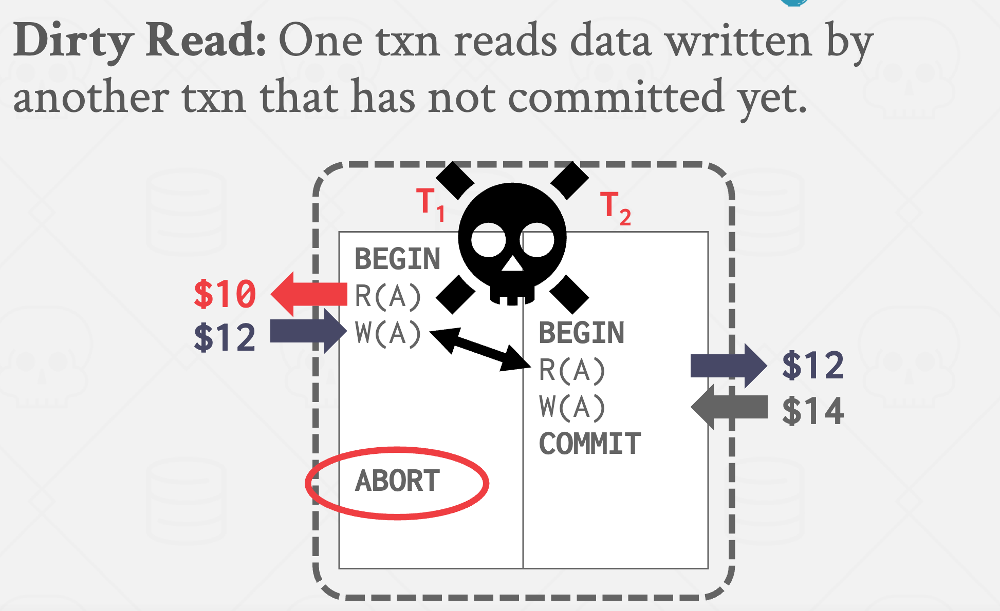
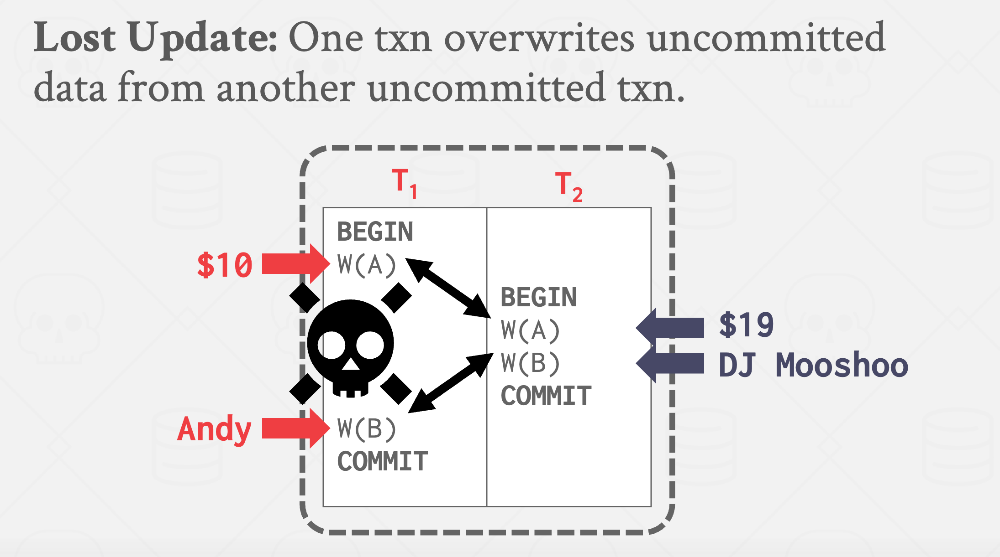
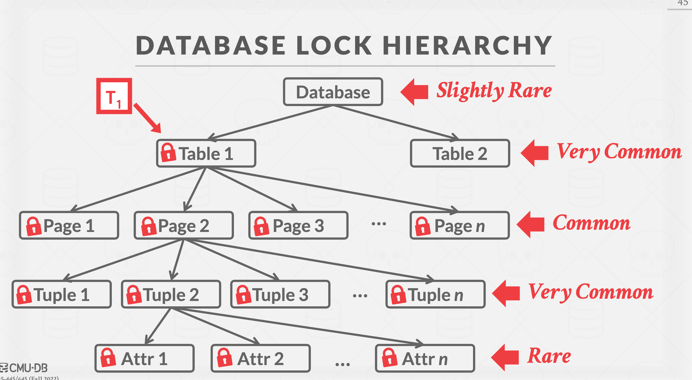
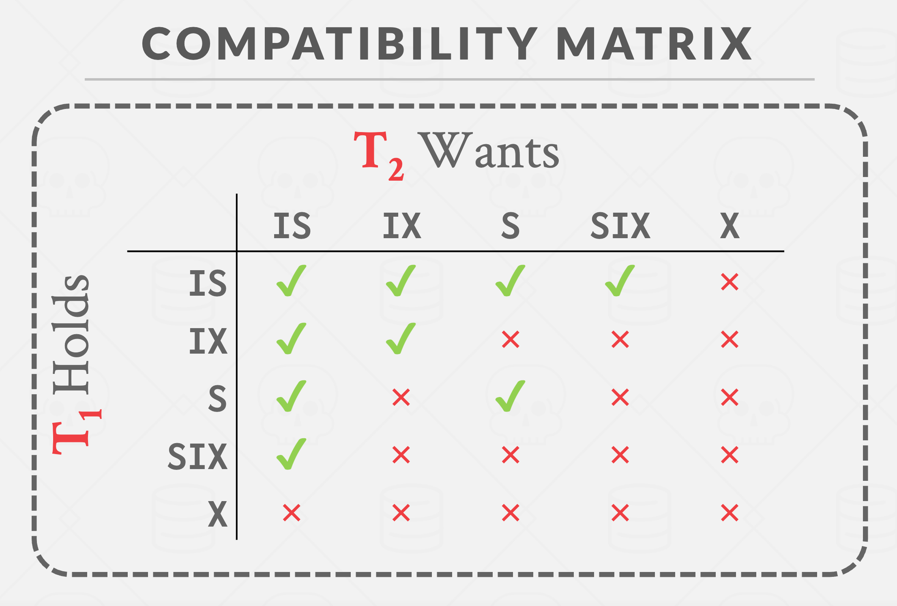

# 15 并发控制理论
* 事务
    * 事务开始与begin
    * 事务结束语commit或abort
* 正式的定义
    * 数据库： 一个固定的命名数据对象集合（例如，A、B、C...）
    * 事务： 一系列的读写操作（R(A)，W(B)，...）

* 正确的基准：ACID  
    * Atomicity 原子性
        * 实现院子性的机制
            * 方法1： 日志
                * DBMS记录所有操作，以便可以撤销已中止事务的操作。
                * 在内存和磁盘上都保留撤销记录。
                * 把这个想象成飞机上的黑匣子...

            * 方法2：影子分页 不常用
                * 复制一份要修改的数据，并对其进行修改，如果提交则将复制大的数据置为最新，否则丢弃。
    * Consistency 一致性 ： 当访问一个数据时，该数据必须是最新的数据
        + 数据库一致性
            * 数据库准确地模拟了现实世界并遵循完整性约束。
            + 未来的事务可以在数据库中看到过去已提交的事务所产生的影响。
        * 事务一致性
            * 如果事务开始之前数据库是一致的（独立运行），那么事务结束后它仍然会保持一致。

    * Isolation 隔离性  
        * 用户提交事务，每个事务都会像独立运行一样执行。
        * 实现机制
            * 并发控制协议是DBMS决定多个事务操作的适当交错方式。

            * 有两类协议：
                * 悲观型：首先防止问题的发生。
                * 乐观型：假设冲突很少，处理它们在其发生后。

        * 调度的正式属性
            * 序列化调度
                * 一个不会交错不同事务操作的调度。
            * 等效调度
                * 对于任何数据库状态，执行第一个调度的效果与执行第二个调度的效果相同。

    * Durability 持久性

* 冲突操作
    * 我们需要一个正式的等价概念，可以基于"冲突"操作的概念高    现  
    * 两种冲突操作
        * 来自两个不同的事物
        * 对同一个对象，在同一时间执行写操  
    * 交错执行异常
        * 读写冲突
            * 解决方法： 一个事务在某一个事物时，不允许其他 对其进行修改-可重复度
            * 
        * 写读冲突
            * 解决方法： 在一个事务在写入时，不允许其他事务读   读以提交
            * 
        * 写写冲突
            * 

* 冲突序列化调度
    * 如果调度是等效的则
        * 它们涉及相同的行为和相同的交易。
        * 每对冲突的行为都以相同的顺序排序。

    * 如果调度是冲突可序列化的
        * S与某个串行调度是冲突等价的。
        * 直觉：你可以通过交换不同事务的连续非冲突操作，将S转化为一个串行调度

    * 序列化调度在多个事物中需要安排的事情太多，因此需要更好算法

* 依赖图
    * 一个节点表示一个事务
    * 如果事务1 先于 事务2锁住了一个资源，则事务1节点指向事务2  
        * 难道不是反的吗？
        
# 16 2阶段锁
* 并发控制协议
    * 2阶段锁是并发控制协议，用于确定事务是否可以在运行时访问数据库中的对象。

    * 阶段1： 增强
        * 每个事务从数据库管理系统的锁管理器请求所需的锁
        * 锁管理器授予/拒绝锁请求。
    * 阶段2：下降
        * 事务只能释放/降级之前获取的锁，不能获取新的锁。

    * 2PL单独就足以保证冲突可串行性，因为它生成的调度具有无环的优先图。
    * 但它有可能发生级联终止

    * 有一些可能是可串行化的时间表，但由于锁定限制并发性，2PL不允许它们。
        * 大多数数据库管理系统更注重正确性而非性能。

    + 但是还是会有脏读问题
        * 解决方案： 强严格2阶段锁
            * 强严格2阶段锁： 事务只允许锁在事务结束之后释放

    * 2PL无法避免死锁
        * 解决方案： 死锁侦测， 死锁预防

        + 死锁侦测
            * DBMS会创建一个等待图来跟踪每个事务正在等待获取的锁。
                * 节点是事务
                * 从T1指向T2的边为T1等待T2释放锁

            + 系统定期检查等待图中的循环，并决定如何打破它

            * 死锁处理
                * 当数据库侦测到死锁，他会选择牺牲品事务，用于回滚并破坏锁的循环
                * 受害者事务将根据其被调用的方式，要么重新启动，要么中止（更常见）。
                * 频繁检查死锁和事务等待解除死锁之间存在权衡。

                * 选择适当的牺牲者事务取决于很多变量
                    * 基于年龄（最小的时间戳）
                    * 基于处理（最多或最少查询执行）
                    * 基于多少个锁已被锁住
                    * 基于事物需要回滚多少内容

                * 还需要考虑该事物已经被重启了多少次，以防止饥饿事务

                * 回滚长度
                    * 当决定了牺牲者事务后，要决定回滚多远

                    * 方法1：完全回滚
                    * 方法2：不分回滚
                        * 
            
        * 死锁预防
            * 当事务尝试获取的锁已经被其他事物所有，数据库杀死其中一个，防止死锁
            * 根据时间戳分配优先级
                * 旧的时间戳 = 更高的优先级

            * Wait-Die （老的等待年轻）
                * 如果请求事务的优先级高于持有事务，则请求事务将等待持有事务。
                * 否则，请求事务将中止。
            * Wound-Wait（ 年轻的等待老的）
                * 如果请求事务的优先级高于持有事务，那么持有事务将会中止并释放锁。
                * 否则，请求的交易将等待。

    * 锁的粒度
        * 当一个事务想要获取一个“锁”时，数据库管理系统可以决定该锁的粒度（即范围）。属性？元组？页？表？

        * 数据库管理系统应该尽可能地获得事务所需的最少数量的锁。

        * 并行性与开销之间的权衡。→ 较少的锁，较大的粒度 vs. 更多的锁，较小的粒度。

        * 

        * 意向锁
            * 一个意向锁允许高级节点在不必检查所有子节点的情况下以共享或独占模式进行锁定。

            * 如果一个节点以意向模式被锁定，那么某个事务正在树的较低层级上进行显式锁定。

            * 种类
                * IS 意向共享锁
                    * 表示在较低级别上使用共享锁进行显式锁定
                * IX 意向排他锁
                    * 显示在较低级别上使用独占锁的显式锁定
                * SIX 共享+意向排他锁
                    * 该节点为根的子树在共享模式下被显式锁定，并且在较低级别上使用排他模式锁进行了显式锁定。
                * 相容矩阵
                    * 

            * 每个事务在数据库层次结构的最高级别上获得适当的锁。
            * 要在节点上获取S或IS锁，事务必须至少持有父节点上的IS锁。
            * 要在节点上获取X、IX或SIX锁，必须至少持有父节点上的IX锁。

        * 锁的恶化
            * 数据库管理系统（DBMS）可以在事务获取过多的低级锁时自动切换到更粗粒度的锁。
            * 这样可以减少锁管理器需要处理的请求数量。
    

# 17 时间戳排序并发控制
* 使用时间戳决定事物的序列化排序
* 如果TS(T1)< TS(T2)，则数据库必须确保，调度执行等于T1先于T2的序列化调度

* 时间戳分配
    * 每一个事物被分配唯一的固定的单调递增的时间戳
    
    * 策略
        * 系统时间
        * 逻辑计数
        * 混合

* 基本时间戳排序
    * 每个对象X都标记有最后一次成功读写的事务时间戳。
        * X的写时间戳 W-TS(X)
        * X的读时间戳 R-TS(X)
    * 对每一个操作都检查时间戳
        * 如果事务尝试访问一个“来自未来的”对象，则中止且重新执行

    * 基本时间戳排序-读取
        * 如果TS(T1) < W-TS(X) 则违反了T1相对于X的写入者的时间戳顺序。
            * 中止T1且重新开始新的事物
        * 否则
            * 允许T1读取X
            * 更新R-TS(X)值MAX(R-TS(X), TS(T1))
            * 为了确保 Ti 的可重复读取性，请将 X 做一个本地副本。

    * 基本时间戳排序-写入
        + 如果哦TS(T1)< R-TS(X) 或 TS(T1)< W-TS(X)，则中止且重新执行T1
        * 否则
            * 允许T1写入X且更新 W-TS(X)
            * 为了确保 Ti 的可重复读取性，请将 X 做一个本地副本。

* 托马斯写入规则
    * 如果TS(T1)< R-TS(X)
        + 中止且重新执行T1

    * 如果TS(T1)< W-TS(X)
        * 托马斯写规则：无视这次写入，并允许事务继续执行，而不是中止
        * 这违反了T1的时间戳排序
    * 否则
        * 允许T1写入X并更新W-TS(X)

### 乐观并发控制
* 数据库为每一个事务创建私有的工作区域
    * 任何读取的对象都会被复制到工作区。
    * 工作空间已应用修改。

+ 当事务提交，诗句哭比较工作的写入集，观察是否与其他事务有冲突
* 如果没有冲突，则写入集放入到全局数据库中

* OCC 阶段
    * 读取阶段
        * 跟踪事务的读/写集，并将它们的写操作存储在私有工作空间中。
    * 验证阶段
        * 当一个事务提交时，检查它是否与其他事务冲突。
        * 检查与其他线程冲突的方法
            * 方法1：向后验证
                * 检查正在提交的事务是否与已经提交的任何事务的读/写集相交。
            * 方法2：向前验证
                * 检查正在提交的事务是否与尚未提交的任何活动事务的读/写集相交。
    * 写入阶段
        * 如果验证成功，则将私有更改应用于数据库。否则中止并重新启动事务。

### 幻象问题
* 

    

