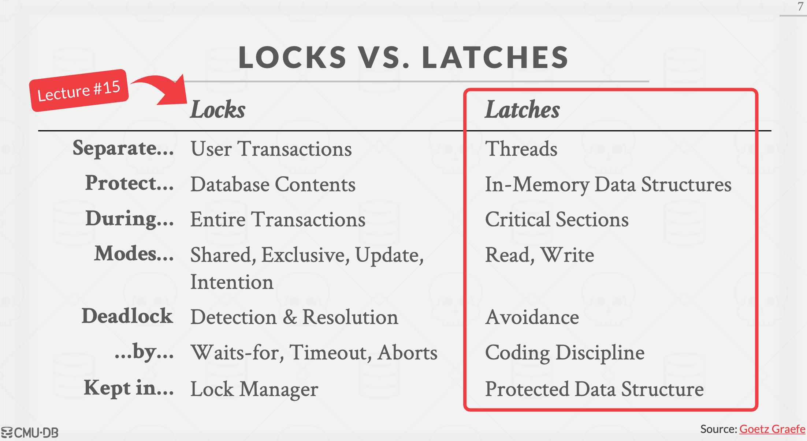
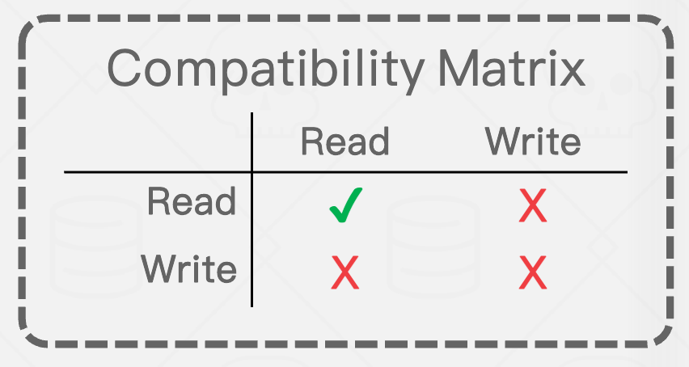

# Tree index   8  
* **表索引**是表中属性的子集的副本，它被组织成能够有效的访问那些属性。

* 数据库系统的工作是识别对于每一个查询的最有效的索引。
* B+树索引
    * B+树索引是自我平衡的数据结构，对于数据的存储，搜索，顺序访问，插入和删除总是保持O（log n）的复杂度
    * B+树是M路搜索树，具有如下性质
        * 完美平衡
        * 每个节点，除了根节点，其内部键必须满足**大于等于** 半满减一，且**小于**全满减一（半满是指指针总数的一半）
        * 每个内部节点都有K个键和K+1非空子节点
    * 每一个树的节点有键值对的数组组成的
        * 键是从索引所基于的属性派生出来的
        * 值基于节点的分类，分为内部节点和页节点两种
        * 页几点的值可以是记录的ID（页ID，槽ID），或者是元组的值
    
    * 插入处理
        * 找到要插入的页节点L
        * 插入数据到页节点L，同时要保持节点内数据的顺序
        * 如果L右足够的空间，则结束
        * 否则，分割L的键为L和L2
            * 重新部署L和L2，将L2第一个键作为条目插入到L和L2的父节点中
            * 在父节点中添加指向L2的指针
            * 在父节点中递归的执行插入的处理

    * 删除处理
        * 从根节点开始，寻找页节点L，并从页节点中删除条目
        * 如果页节点L处于半满以上的状态，则结束
        * 如果页节点L只有半满减一的状态，
            * 则首先尝试重新分配，从兄弟节点中借入节点（借出后的兄弟节点必须处于半满以上的状态）
            * 如果尝试借入失败，则将L于兄弟节点进行合并，合并为一个节点。
                * 因为删掉了一个节点，因此删除节点的操作会向上传播。
      
    * 数据库可以使用B+树索引，将多个属性合并为一个键，并提供索引的功能
    * 加入两个属性做成联合索引，则两个属性称为索引的键形成索引
        * 此时，如果只对第一个属性进行检索，执行过程与对一个属性有了索引后进行查询一样。
        * 如果只对第二个属性进行检索，效果将有所不同，因为属性1-属性2的形式建立了索引的键，找到第一个满足条件的页节点的键后，需要一条条的顺序遍历每一个条目才能获取满足条件的值。（有可能不对）

    * 重复的键
        * 方法1 ： 将记录ID与键同时存储
        * 方法2 ： 过载页节点

    * 聚集索引： 以主键为索引
        * 当主键为索引时，查询的结果将会是主键的顺序排列

    * 合并阈值
        * 有些系统推迟合并（小于半满时合并），降低重新组织的成本

    * 可变长度的键
        * 当键的长度可变时，对于比较会有很大的浪费的问题，因此使用如下处理
            * 将键作为指针存储在记录中
            * 可变长度的节点
            * padding，将键的长度填充至最大
            * 键映射，非直接映射

    * 内部节点的搜索
        * 线性搜索
        * 二分搜索
        * 根据键的分布推测键的位置

    * 优化
        * 前缀比较
        * 重复
        * 后缀截取
        * 。。。 P49开始可参考
     
# 索引并发控制

* 并发控制协议是使DBMS的使用能够在并发操作共享对象的前提下返回正确的结果的方法。
* 协议的正确性包括逻辑的正确与物理的正确
    * 该节讨论物理的正确性
* lock与latch
    * 
        
* latch模式
    * 读写模式
        * 两者的关系
            * 

* 哈希表锁
    * 所有线程都是以相同的方向每次只能有一个访问页

    * 页的latch
        * 对整个页进行加锁
    * 槽的latch
        * 对页中的槽加锁

* B+树并发控制
    * 需要从两个问题中保护树
        * 多个线程在同一时刻对树进行修改
        * 一个线程横渡树时，另一线程对树进行分割或者合并操作

    * 对于多个线程修改树时，应对策略
        * 获取父节点的latch
        * 获取子节点的latch
        * 如果判断父节点是安全的，则释放父节点的latch 
            * 当父节点没有处于满的状态，因此不需要分割
            * 当父节点没有处于半满状态，因此不需要合并

    * Latch crabbing（爬行） 
        * 查找从根节点开始向下遍历树
            * 在子节点取得读Latch
            * 之后释放父节点的latch
            * 重复直到到达叶子节点

        * 插入与删除：从根开始向下 
            * 在需要时取得写latch，当取得子节点的latch后检查子节点是否安全，如果安全则释放祖先
    
    * 更好的latch算法
        * 查找与latch crabbing相同
        * 插入与删除
            * 从根开始设置读latch向下查找，并在叶子节点，取得写latch
            * 当叶子节点需要合并或删时，从根开始从新执行latch crabbing一样的算法。